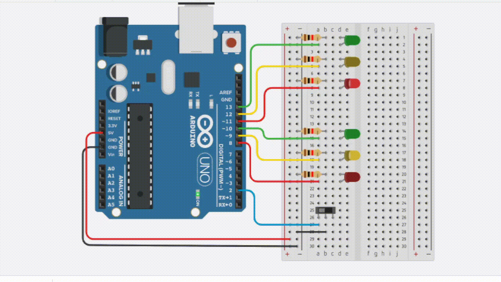

# Semáforo com pisca Alerta
Em algumas cidades os semáforos entram em alerta durante a madrugada, ou seja, apenas os leds na cor amarela ficam piscando fazendo com que o motorista preste apenas atenção ao cruzar, esse método é utilizado em cidades com pouco ou quase sem nenhum trânsito na madrugada, isso evita o motorista ficar parado no sinal e ser assaltado por exemplo. E este é um projeto simples para simular esta situação seja para fazer apenas por diversão ou educação, consite em quando o botão físico for desativado o semáforo entra em modo alerta, ao botão ser ativado o sinal funcionará normalmente.

**🚦Modo alerta (Chave Desligada)**

**🚦Funcionando Normal (Chave Ligada)**

**ℹ️Lembrete Amigavél**

Este código foi escrito e compilado para a placa com chip Esp32, mas para demonstrações na imagem foi utilizado o arduino, ao configurar as entradas no cabeçalho `#define` coloque a numeração correta da sua placa, caso utilize o arduino.

**🗂️Bibliotecas Utilizadas:**
- 📁Bounce2 - [version 2.71.0 ⬇️](https://downloads.arduino.cc/libraries/github.com/thomasfredericks/Bounce2-2.71.0.zip).
